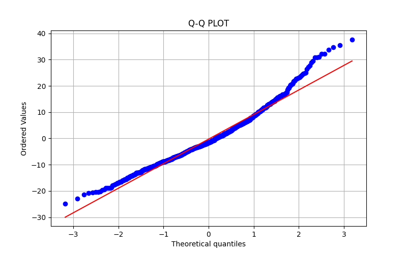
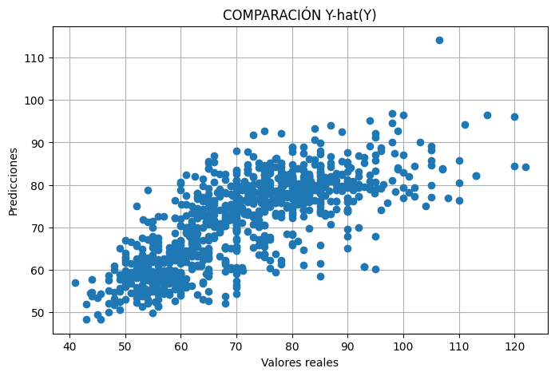

# Respuestas — Práctica Final: Análisis y Modelado de Datos

> Rellena cada pregunta con tu respuesta. Cuando se pida un valor numérico, incluye también una breve explicación de lo que significa.

---

## Ejercicio 1 — Análisis Estadístico Descriptivo
---
El dataset contiene una muestra de 11352 elementos de los cuales se observan 28 variables relacionadas con sus medidas corporales, teniendo varias de ellas muestran más de un 50% de datos faltantes. Puesto que interpolar tantos datos podría crear sesgos en los resultados y aún eliminando estas filas se siguen conservando casi 5000 elementos en la muestra (suficientes para la regresión), se ha decidido eliminarlos.
También se han eliminado las columnas que no van a ser necesarias para la regresión (aunque se han conservado algunas más por si pudieran ser usadas también).

Antes de empezar con el análisis estadístico, ha sido necesario cambiar el tipo de las variables de *str* a *float* y el nombre de las columnas a uno más simple para poder trabajar con el dataset. Fue necesario además hacer la búsqueda de outliers antes del análisis porque los primeros cálculos daban resultados que no eran posibles. En efecto, la mayoría de outliers presentes no se correspondían con medidas atípicas pero posibles (como que la mayoría de personas midan entre 160 y 180cm pero haya un registro de 200cm), sino que eran datos imposibles, probablemente mal escritos. Se consideraron varias alternativas, como sustituir el dato incorrecto interpolando o directamente con el valor de otra columna equivalente de la mismo observación (por ejemplo, se sabe que la altura es aproximadamente igual a la envergadura) pero, por simpleza al ser pocas este tipo de observaciones, se decidió eliminarlas.

El análisis estadístico de los datos numéricos muestra que estamos trabajando con una muestra de personas jóvenes, de media 22 años y complexión delgada (176cm de altura y 71kg de media), lo que era de esperar pues los datos pertenecen a los estudiantes de una universidad de Eslovaquia. Aún así, vemos una gran variabilidad en la edad que se refleja concretamente en la diferencia de casi 60 años del cuartil 3 al máximo, indicando una distribución con una gran asimetría hacia la izquierda. Con el peso sucede algo parecido pero mucho más sutil. El resto de variables puede decirse que siguen una distribución normal, como así lo indican sus coeficientes de asimetría y curtosis, además de sus histogramas.

Para trabajar con la única variable categórica del dataset (*gender*), se ha decidido crear a su vez otra nueva que refleje los distintos grupos de edad. El principal objetivo es obtener más información sobre la distribución de la edad, como qué otras edades se están contemplando en el dataset y en qué cantidad (se podrían haber recalculado los estadísticos para obtener una información más concreta pero se ha preferido no dispersarse mucho con respecto a la línea principal del ejercicio). En relación al género, vemos que la muestra está ligeramente descompensada, con un 58.84% de hombres y un 41.15% de mujeres, aunque no tanto como para llegar a ser un problema. Donde más diferencia hay es en el grupo juvenil, donde la proporción de hombres es más del doble que la de mujeres. Por el contrario, en los adultos la situación es la contraria, aunque es un grupo que no tiene gran relevancia en el total por no llegar ni al 3% del total. El grupo más numeroso es, sin duda, el de adultos jóvenes con un 68.51%.

Si nos centramos ahora en la variable objetivo, vemos que la diferencia del peso entre hombres y mujeres aumenta con la edad. En los grupos más jóvenes la diferencia es, en ambos, de aproximadamente 20kg, teniendo los hombres de media entre 75 y 80kg y las mujeres algo menos de 60kg. Con los años también aumenta la variabilidad. En efecto, vemos como en el grupo adulto el rango intercuartílico es igual (para las mujerer) o mayor (para los hombres) de 20kg. Por último, vemos como existen bastantes datos atípicos por encima del máximo (1.5 veces el IRC), indicando la gran variabilidad a la que está sujeta el peso incluso dentro de un mismo grupo de edad.

Por último, si observamos la matriz de correlación vemos que, como era de esperar, las medidas corporales como el largo de las piernas o la altura de los hombros están correladas positivamente a la altura con un coeficiente superior al 60%. A su vez, el peso también está correlacionado positivamente a las medidas del cuerpo pero en un grado algo menor (no se llegan a ver correlaciones con coeficientes del 0.91 o 0.84 por ejemplo) pues, aunque un cuerpo más grande tiene necesariamente una base más pesada, existen otros factores que afectan directamente al peso, como la alimentación, el ejercicio, posibles enfermedades endocrinas... El género también tiene una correlación significativa (-0.6) que refleja la diferencia ya vista en el boxplot (si suponemos que ser hombre es igual a 0 y mujer a 1). La edad es la variable con menor correlación (0.16).

---

**Pregunta 1.1** — ¿De qué fuente proviene el dataset y cuál es la variable objetivo (target)? ¿Por qué tiene sentido hacer regresión sobre ella?

Los datos son parte del National Library of Medicine, concretamente del [**Dataset on anthropometric measurements of the adult population in Slovakia**](https://pmc.ncbi.nlm.nih.gov/articles/PMC11214164/).

Ya tomé este dataset con anterioridad para estudiar estadísticamente la veracidad de las proporciones del hombre de Vitruvio con datos antropométricos reales. En este contexto tiene sentido, tomando el peso como variable objetivo, hacer una regresión lineal usando como variables independientes la altura, la envergadura, la edad o el género, para determinar en qué medida estas medidas estructurales del cuerpo explican el peso total (los coeficientes *b_i* representarían la contribución de cada medida al peso, reflejando la relación entre la complexión corporal y la masa del individuo).

Es necesario tener en cuenta que, si bien la complexión física interviene en el peso, el dataset carece de otro tipo de variables que son determinantes pero no tienen que ver con la antropometría por lo que la bondad de ajuste probablemente sea moderada.

**Pregunta 1.2** — ¿Qué distribución tienen las principales variables numéricas y has encontrado outliers? Indica en qué variables y qué has decidido hacer con ellos.

Las variables numéricas siguen todas una distribución normal excepto la edad pues los datos recogidos son mayoritariamente de jóvenes entre 18 y 25 años (en el link anterior se especifica que los datos se centran en estudiantes, así que era esperable). Los outliers eran principalmente valores irreales, probablemente mal introducidos, de modo que ajustando el coeficiente del método IQR de 1.5 a 2 son fácilmente aislables. 

Un buen ejemplo son los outliers de la variable 'height'. Tomando el método IQR con un coeficiente igual a 1.5 resultaban los outliers 18cm, 1975cm y 205cm. Cambiando el coeficiente a 2 quedaron solo 18cm y 1975cm.

Puesto que eran pocos se consideró sustituirlos por las medias de altura en base a la envergadura (variable *arms_reach*) o eliminarlos. Como se tienen suficientes datos para la regresión y para evitar crear sesgos, finalmente se eliminaron.

**Pregunta 1.3** — ¿Qué tres variables numéricas tienen mayor correlación (en valor absoluto) con la variable objetivo? Indica los coeficientes.

Las variables con mayor correlación con weight son height, gender y shoulder_height con coeficientes de correlación iguales a 0.68, -0.60 y 0.65 respectivamente.

El hecho de que height y shoulder_height correlacionen con el peso de forma moderada es esperable: las personas más altas tienden a tener mayor masa corporal, aunque la relación no es tan directa como entre medidas puramente esqueléticas, ya que el peso depende también de la composición corporal. En relación a la variable gender, los hombres presentan de media mayor peso que las mujeres, lo que explica la correlación negativa dado que gender está codificada como M=0, F=1.

**Pregunta 1.4** — ¿Hay valores nulos en el dataset? ¿Qué porcentaje representan y cómo los has tratado?

La mayoría de columnas del dataset tienen más del 50% de sus datos nulos. Puesto que interpolar tantos datos podría crear sesgos en los resultados y aún eliminando estas filas se siguen conservando casi 5000 elementos en la muestra (suficientes para la regresión), se ha decidido eliminarlos. 

---

## Ejercicio 2 — Inferencia con Scikit-Learn

---
Puesto que es difícil evitar la multicolinealidad en datos antropométricos, en este caso se hará una regresión sobre las variables *gender*, *age*, *height* y *arms_reach*, pues no están tan directamente relacionadas (independientemente de su coeficiente de correlación) entre ellas como *shoulder_height* y *height*. 

Para empezar, se binariza la variable *gender* y se toman solo las columnas del dataset que van a ser usadas, dividiéndolas en dos grupos para entrenar y testear. La recta de regresión resultante tiene la siguiente forma: 

      y = -78.008 - 6.536*X_{gender} + 0.534*X_{age} + 0.694*X_{height} + 0.104*X{arms_reach}

* La variable *gender* es la que tiene mayor peso en la regresión. Concretamente, el modelo estima que las mujeres (1) pesan de media 6.536kg menos que los hombres (0). Es un resultado biológicamente coherente y además concuerda con lo visto en la parte de estadística descriptiva.

* La variable *age* tiene un efecto bastante moderado y muestra que las personas tienden a engordar con el tiempo, concretamente medio kilo por cada año que cumple.

* La variable *height* es la segunda con mayor peso, aunque su efecto es más cercano al de *age*. Muestra que el peso aumenta aproximadamente 0.7kg por cada cm de altura.

* La variable *arms_reach*, correspondiente a la envergadura, es la menos influyente con un peso de 0.1. 

* En este caso, el intercepto no tiene interpretación directa dado que el valor cero no es observable en ninguna de las variables del modelo.

El coeficiente de determinación es 0.535, de modo que el modelo explica el 53.5% de la variación de la altura, lo cual indica un ajuste aceptable pero tampoco bueno. Esto puede deberse, como ya habíamos visto, a la falta de variables en el dataset como la alimentación, ejercicio diario... Si lo comparamos con el resultante para los valores del test (0.55), vemos que el modelo generaliza bien y no hay overfitting.

Pasando a los errores, vemos que el MAE es de 7.303kg y el RMSE de 9.476kg. Son relativamente grandes teniendo en cuenta que estamos tratando de predecir datos antropométricos. Que se diferencien en poco más de 1kg indica que no hay errores muy grandes que estén inflando el RMSE (el modelo comete errores homogéneos).

Finalmente, la gráfica de residuos muestra una nube de puntos sin patrón aparente lo que significa que siguen una distribución normal, condición necesaria para validar el modelo. Es cuando se grafica el Q-Q plot que vemos cómo el conjunto de datos tienden a ajustarse a la recta en el centro de la gráfica pero se alejan en los extremos y en direcciones opuestas, indicando una distribución con colas pesadas.

<figure>
  
</figure>

---

**Pregunta 2.1** — Indica los valores de MAE, RMSE y R² de la regresión lineal sobre el test set. ¿El modelo funciona bien? ¿Por qué?

* MAE: 7.303
* RMSE: 9.476
* R²: 0.535

El modelo funciona correctamente. El coeficiente de determinación es lo suficientemente alto (> 0.535) como para asumir que la regresión tiene un ajuste moderado aunque válido. Además, que el error absoluto y cuadrático se diferencien en menos de 2kg es indicativo de que no hay outliers con una gran penalización por parte del RMSE.

Aún así, al tratarse de datos antropométricos, un error de entre 7 y 10kh se puede considerar alto y puede crear una dispersión notoria en los resultados. Esto se ve en la siguiente imagen:

<figure>
  
</figure>

---

## Ejercicio 3 — Regresión Lineal Múltiple en NumPy

---
Para todas las funciones de este ejercicio se han seguido las indicaciones dadas:

* Para la función *regresion_lineal_multiple* se añade una columna de unos tanto a X_train como a X_test con *np.hstack* y *np.ones*. Para calcular los coeficientes en lugar de invertir y multiplicar, se ha resuelto el sistema con *np.linalg.lstsq*. Para las predicciones simplemente se multiplica X_test por y_test.

* Para *calcular_mae*, *calcular_rmse* y *calcular_r2* se ha implementado tal cual la definición de los estadísticos.

Los resultados para los datos dados en el [ejercicio 3](ejercicio3_regresion_multiple.py) no difieren en exceso a las referencias. Para el dataset elegido se obtienen los mismos resultados que en [ejercicio 2](ejercicio2_inferencia.py). Se concluye entonces que las funciones cumplen con su objetivo.

---

**Pregunta 3.1** — Explica en tus propias palabras qué hace la fórmula β = (XᵀX)⁻¹ Xᵀy y por qué es necesario añadir una columna de unos a la matriz X.

La fórmula dada devuelve la estimación mediante mínimos cuadrados del vector de coeficientes de la recta de regresión lineal múltiple. El objetivo es hallar los coeficientes que minimizan la suma de cuadrados de los residuos, de modo que la recta resultante es la óptima. 

La columna de unos que se tiene que añadir a la matriz X se corresponde con el escalar que multipla a b_0 en la ecuación. Si no se incluyera, no se podría incluir b_0 en el vector de coeficientes y por tanto no se podría calcular junto al resto (el vector de coeficientes y la matriz de observaciones tendrían dimensiones incompatibles para multiplicarlos). Es como asumir que existe una cierta variable observada X_0 que siempre es 1 y cuyo coeficiente será b_0.

**Pregunta 3.2** — Copia aquí los cuatro coeficientes ajustados por tu función y compáralos con los valores de referencia del enunciado.

| Parametro | Valor real | Valor ajustado |
|-----------|-----------|----------------|
| β₀        | 5.0       |   4.864995     |
| β₁        | 2.0       |   2.063618     |
| β₂        | -1.0      |   -1.117038    |
| β₃        | 0.5       |   0.438517     |

Los resultados son buenos en general. Los dos últimos coeficientes son quizás los más problemáticos por tener los mayores errores relativos, un 11.7% y un 12.3% sobre el valor real, pero tampoco presentan una diferencia preocupante.

**Pregunta 3.3** — ¿Qué valores de MAE, RMSE y R² has obtenido? ¿Se aproximan a los de referencia?

* MAE: 1.166462
* RMSE: 1.461243
* R²: 0.689672

Tanto el MAE como el RMSE están dentro del valor de referencia dado (±0.20), por lo que se consideran buenos resultados. El coeficiente de determinación, sin embargo, está ligeramente por debajo (-0.02 aprox.) de la referencia, aunque no es una diferencia preocupante.

**Pregunta 3.4** — Compara los resultados con la reacción logística anterior para tu dataset y comprueba si el resultado es parecido. Explica qué ha sucedido. 

Los resultados son:

* Coeficientes: [89.80585654 -4.61373969  0.12753115  0.45162687]
* MAE: 3.355615694718736
* RMSE: 4.387199056773674
* R2: 0.772467159702112

Los resultados son exactamente iguales a los obtenidos en el ejercicio anterior. Lo que ha sucedido es que las funciones implementadas en este ejercicio cumplen la misma función que las de scikit-learn y calculan los resultados usando las mismas ecuaciones (las definiciones de los estadísticos).
---

## Ejercicio 4 — Series Temporales
---
La serie temporal presenta una estructura bien definida al descomponerse en sus componentes fundamentales. 

* La tendencia muestra un crecimiento casi lineal sostenido, lo que indica que el nivel medio de la variable aumenta progresivamente con el tiempo. Se observa una ligera aceleración en los años más recientes, especialmente a partir de 2021, lo que podría reflejar un cambio en la dinámica subyacente del proceso. 

* La estacionalidad es muy marcada y tiene un patrón muy regular y consistente de carácter anual, por lo que puede asumirse que es un componente estructural importante de la serie. 

* No se observan ciclos de medio o largo plazo. 

El análisis de los residuos refuerza la calidad del modelo de descomposición, ya que estos se comportan como ruido aleatorio. Presentan una media cercana a cero (0.127) y una desviación típica moderada (3.22), lo que indica una dispersión controlada. Además, los coeficientes de asimetría (-0.051) y curtosis (-0.061) son cercanos a cero, lo que junto al histograma de los residuos permite aceptar la hipótesis de normalildad a pesar del resultado del test de Jarque-Bera, cuyo p-valor es 0.5766. Asimismo, el test ADF arroja un p-valor de 0.0000, indicando que los residuos son estacionarios. En resumen, se valida la adecuación de la descomposición realizada y se afirma que la serie está bien modelizada mediante sus componentes de tendencia y estacionalidad.

---

**Pregunta 4.1** — ¿La serie presenta tendencia? Descríbela brevemente (tipo, dirección, magnitud aproximada).

La serie presenta una tendencia lineal creciente con magnitud de 0.0477 unidades por período (17.4081 unidades por año).

**Pregunta 4.2** — ¿Hay estacionalidad? Indica el periodo aproximado en días y la amplitud del patrón estacional.

La serie tiene una tendencia anual muy repetitiva y estable. La amplitud del patrón estacional es constante por ser una serie aditiva. Alcanza sus máximos relativos durante la primera mitad del año, alcanzando el mínimo absoluto en lo que parece visualmente el final del tercer trimestre y principio del cuarto.

**Pregunta 4.3** — ¿Se aprecian ciclos de largo plazo en la serie? ¿Cómo los diferencias de la tendencia?

Más allá de la estacionalidad, no se aprecian ciclos claros. Las ondas representadas parecen estar completamente explicadas por la estacionalidad.

**Pregunta 4.4** — ¿El residuo se ajusta a un ruido ideal? Indica la media, la desviación típica y el resultado del test de normalidad (p-value) para justificar tu respuesta.

Están bastante centrados en el cero y no muestran un patrón visible, de modo que podría decirse que es aleatorio. Además, la dispersión es relativamente constante.

---

*Fin del documento de respuestas*
